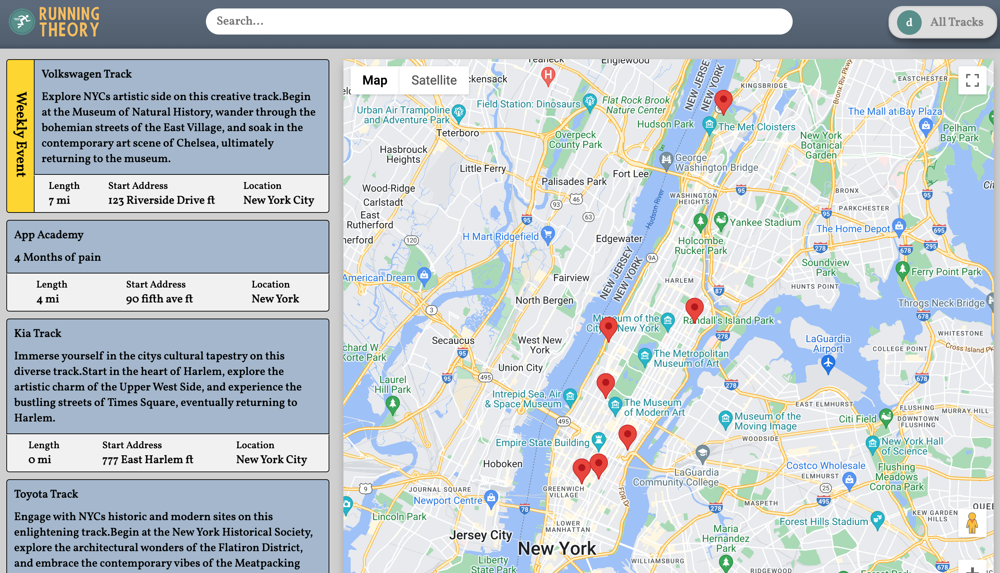
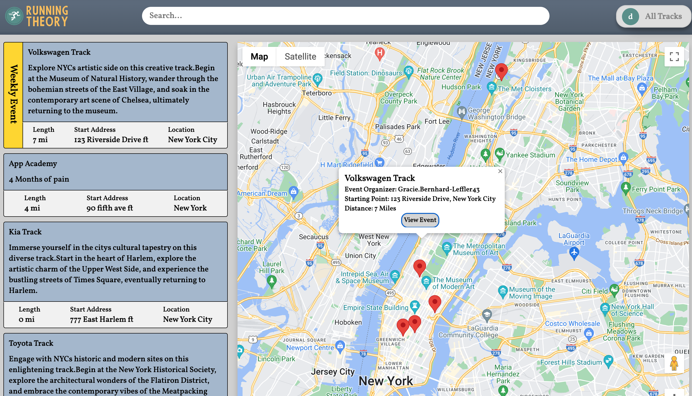
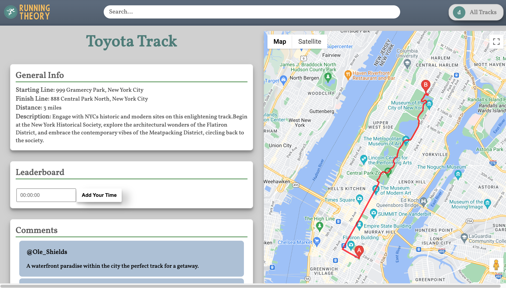
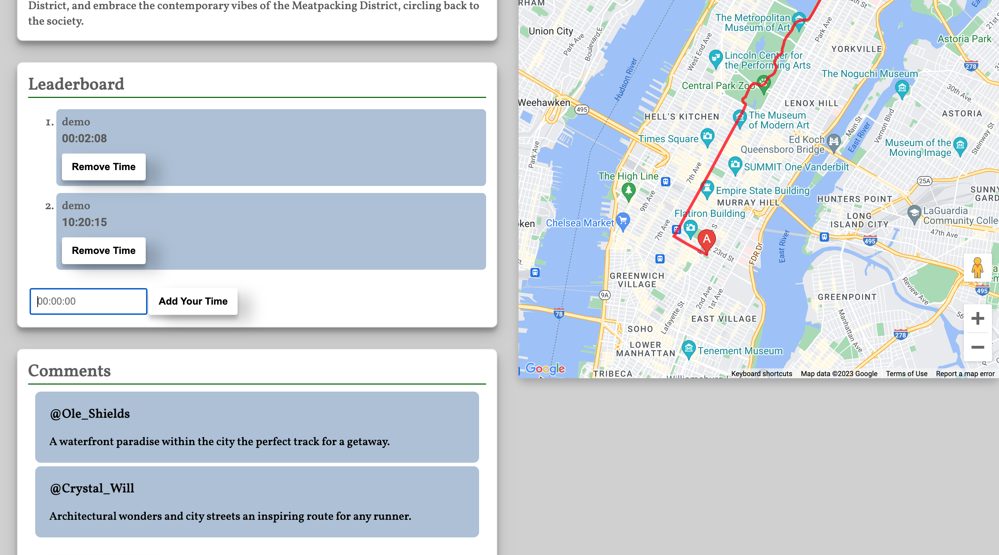
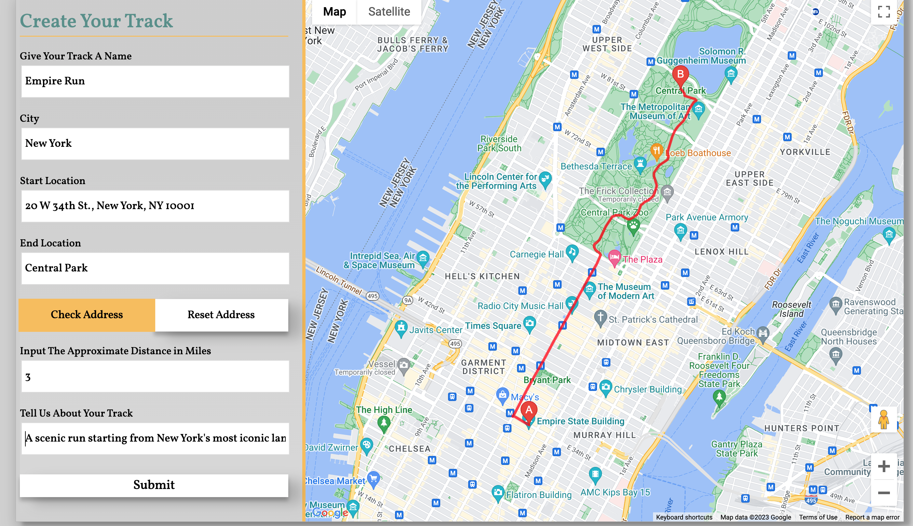
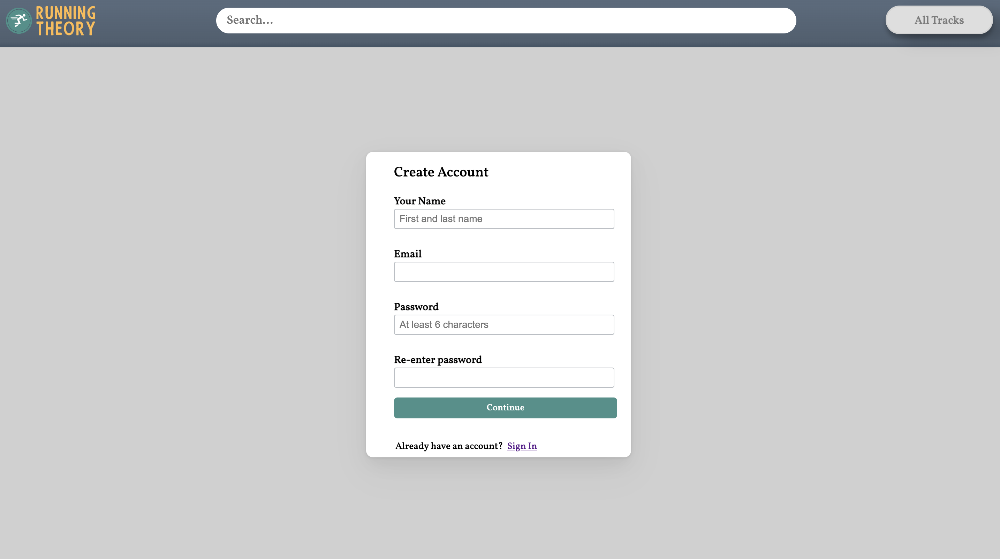
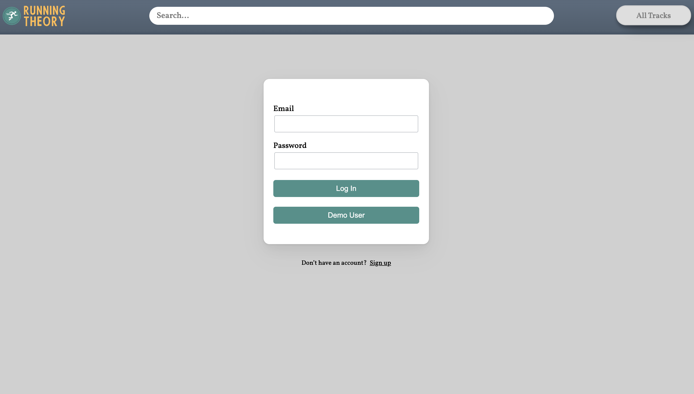

Running Thoery is a competitive fitness site that aims to engage the user through a weekly event. Users are able to navigate the site to find local "tracks" that are running paths created by other users. These paths are mapped and saved so that other users can follow the exact track on a map and post their time after completion. Other users can engage the user created tracks by leaving comments. From these user created tracks, the ones with highest engagement are selected for the weekly event which is displayed for one week at the top of the tracks show page. Users who attend this even can post official times validated by other attendees, these offical times are placed on the leaderboard which is ranked by fastest times. A user also has a show page dedicated to their created tracks and times they have posted for each track.


# Functionality & MVPs


## In Running Theory, users will be able to:

### Navigate the site for different tracks.





### Utilize the map to locate start positions on available tracks.




### View specific track information along with user interaction.





### User engagement on the track show page.



### Create a track and verify its route.





### User's profile page with their posted times and created tracks.


### Account creation.






# Technologies, Libraries, APIs


The Backend- Utilizes MongoDB to provide the logic and database processing to be utilized and rendered on the frontend.


The Frontend - Utilizes React, a Javascript library that implements certain functionalities to simplify frontend interface and scalability.


Redux - A tool for constant information storage, used to persist backend info for ease of navigation and component rendering.


# Feature Implementation 


## Map Rendering

Latitude and logitude values are given to a Google service that will output the marker and positioning standards for a user to
interface with. The useEffect allows for adjustment and correct output of input string locations to render on the map.


``` js 

useEffect(() => {
    if (isLoaded && startLatLng && endLatLng) {
      const DirectionsService = new window.google.maps.DirectionsService();

      DirectionsService.route(
        {
          origin: startLatLng,
          destination: endLatLng,
          travelMode: window.google.maps.TravelMode.BICYCLING,
        },
        (result, status) => {
          if (status === window.google.maps.DirectionsStatus.OK) {
            if (directionsRenderer) {
              directionsRenderer.setDirections(result);
            } else {
              const newDirectionsRenderer = new window.google.maps.DirectionsRenderer({
                directions: result,
                polylineOptions: {
                  strokeColor: '#FF0000',
                  strokeOpacity: 0.8,
                  strokeWeight: 4,
                },
              });
              newDirectionsRenderer.setMap(map);
              setDirectionsRenderer(newDirectionsRenderer);

              // Calculate and set bicycle distance
              if (result.routes && result.routes[0] && result.routes[0].legs && result.routes[0].legs[0]) {
                const distance = result.routes[0].legs[0].distance.text;
                setBicycleDistance(distance);
              }
              
            }
          } else {
            console.error('Error fetching directions:', status);
          }
        }
      );
    }
  }, [isLoaded, map, directionsRenderer, startLatLng, endLatLng]);

```

## Track Input Errors


When gathering input errors during track creation a variable is assigned to catch parameters that would not be allowed.


``` js

const validateTrackInput = [
    check('name')
        .exists({ checkFalsy: true })
        .isLength({ min: 5, max: 140 })
        .withMessage('Track name must be between 5 and 140 characters'),
    check('location')
        .exists({ checkFalsy: true })  
        .withMessage('Location must be a valid city'),
    check('miles')
        .exists({ checkFalsy: true })
        .withMessage('Miles field is required')
        .isFloat({ min: 0, max: 100 })
        .withMessage('Miles must be a number between 0 and 100'),
    check('description')
        .exists({ checkFalsy: true })
        .isLength({ min: 5, max: 140 })
        .withMessage('Description must be between 5 and 140 characters'),
    handleValidationErrors
];

```

## Track Information

Track data is fetched from the backend and placed inside of useSelectors from the state to be rendered on page. Submission of user time inputs is verified and formatted accordingly, multiple parameters are checked if a user inputs time in hours minutes or seconds it can be submitted to the database. 


``` js 

 function TrackShowPage() {
  const dispatch = useDispatch();
  const { trackId } = useParams()
  const author = useSelector(state => state.session.user);
  const [newComment, setNewComment] = useState('')
  const [showCommentForm, setShowCommentForm] = useState(false)
  const comments = useSelector(state => Object.values(state.comments.all))
  const times = useSelector(state => Object.values(state.times.all)).filter(time => time.track._id === trackId)
  const [time, setTime] = useState("")

  useEffect(() => {
    dispatch(fetchTracks())
    dispatch(fetchComments())
    dispatch(fetchTimes())
  }, [dispatch, trackId])

  const track = useSelector(state => Object.values(state.tracks.all).find(track => track._id === trackId))

  function handleSubmit(e) {
    e.preventDefault()
    dispatch(composeComment({ description: newComment, author: author, track: track }))
    setShowCommentForm(false)
    dispatch(fetchComments())
  }

  function handleTimeSubmit(e) {
    e.preventDefault()
    let arrTime = time.split(":")
    if (arrTime.length === 3) {
      dispatch(composeTime({ hours: arrTime[0], minutes: arrTime[1], seconds: arrTime[2], author: author, track: track }))
    } else if (arrTime.length === 2) {
      dispatch(composeTime({ hours: 0, minutes: arrTime[0], seconds: arrTime[1], author: author, track: track }))
    } else {
      dispatch(composeTime({ hours: 0, minutes: 0, seconds: arrTime[0], author: author, track: track }))
    }
    const newTime = { hours: arrTime[0], minutes: arrTime[1], seconds: arrTime[2], author: author, track: track };
    setTime([...times, newTime]);
    setTime("");
    dispatch(fetchTimes());
  }

```

# Future Implementations

* Allow users to edit a track they had made previously
* Create a registration page for events to submit their offical times
* Allow users to compare more detailed stats, such as heart rate or average speed, directly
with another user.
